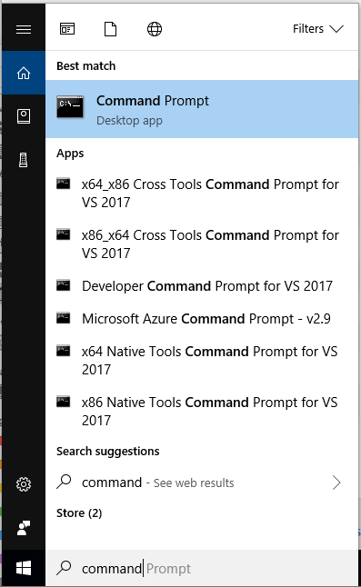

#Predigame Instructional Platform


*Pure Code. Pure Fun. Brain candy for the aspiring coder!*

## Overview
Predigame is an instructional platform that teaches the basics of coding through the creation of arcade games.
The platform was researched and developed by [Predicate Academy](http://predicate.us) and used for teaching kids ages 8-17 all the *amazingly cool things* that can be created with code. Predigame is a minimalistic platform and makes extensive use of coding abstractions to present a "low lift" interface that is especially welcoming to first time coders. Predigame allows aspiring coders to familiarize themselves with *computational thinking* while
downplaying many of the language and keyboard nuances that come with using a text-based coding language. Holding true to form, Predigame seeks to offer a coding experience through the lens of a technologist - specific emphasis is given towards software design, modern programming languages, command line execution, error debugging - skills that are *directly transferrable* in any journey to becoming a software engineer.

Unlike other introductory platforms that teach coding concepts through visual (drag and drop) interactions, Predigame is written in Python and Pygame. While the core gaming platform covers a number of common use cases, Predigame is completely extensible and games can be amplified with custom code.

Predigame requires minimum computing resources and has been tested on Microsoft Windows 10, macOS 10.12+ (Sierra and High Sierra), and Raspberry Pi Model 2B/3B (Raspbian Jessie and Stretch). It may likely run in on other operating systems, we just haven't tested them (yet).

We assume that all users have some basic computer skills: typing, opening/closing windows, as well as an ability to navigate files and folders.

### Example Game - Zombie Madness

Zombie Madness is an instructional implementation that was used by [Predicate Academy](http://predicate.us) during their Winter and Sping 2018 seasonal classes. Many of the features have been curated by ~75 aspiring innovators (ages 10+) who love to flex their STEM prowess by putting ideas to code! Click the image below for a video of the game in action!

[](https://youtu.be/ysMEknhl8Us "Zombie Madness")


### Example Game - Click Ninja

Click Ninja was inspired by the app [fruit ninja](https://fruitninja.com/), but it's a little different since we have a mouse and not a touch screen. Click the image below for a video of the game in action!

[](https://youtu.be/jKYfLYLctHE "Click Ninja")

## Installing Predigame

### Install a Text Editor

Every coder needs a good text editor. For python development, we recommend using [Atom](https://atom.io). New to Atom? Check out their [documentation](https://flight-manual.atom.io/getting-started/sections/atom-basics/). Sorry Pi Users - Atom isn't currently available for Raspbian, so we'd recommend using IDLE or Thonny (both come preinstalled with Raspbian Stretch).

### Microsoft Windows 10

*NOTE: installation will require Administrator permissions*

New to coding and installing stuff? Check out our [Windows Installation Video](https://youtu.be/RD5eD1VoPCI)!


**Install Python**

Predigame has been tested with Python v3.6.4 ([direct download link](https://www.python.org/ftp/python/3.6.4/python-3.6.4-amd64.exe)). When installing, you'll want to make sure to check the box to have Python added to your PATH (it's off by default).


**Install Pygame**

Open a command prompt (search: *command prompt*)



Type the following command in the command prompt window:

```
python -m pip install -U pygame
```

Look for line `Successfully installed ...` to indicate a successful installation.


**Install Predigame**

Open a command prompt (or reuse the window from the previous step) and type the following command:

```
python -m pip install -U predigame
```

This can take a minute or two to complete. Look for the line `Successfully installed ...` to indicate a successful installation.


### macOS

*NOTE: installation will require Administrator permissions*

New to coding and installing stuff? Check out our [macOS installation video](https://youtu.be/7xhS6yW5wjY)!

**Install Python**

Predigame has been tested with Python v3.6.4 ([direct download link](https://www.python.org/ftp/python/3.6.4/python-3.6.4-macosx10.6.pkg)).

**Install Pygame**

Open a Terminal (command search: *Terminal* or visit [this link](http://blog.teamtreehouse.com/introduction-to-the-mac-os-x-command-line) for help). Type the following command in the terminal:

```
sudo pip3 install -U pygame
```

This command will require an administrator account and a prompt for a password. Look for line `Successfully installed ...` to indicate a successful installation.


**Install Predigame**

Open a command prompt (or reuse the window from the previous step) and type the following command:

```
sudo pip3 install -U predigame
```

This command will require an administrator account and a prompt for a password. The process can take a minute or two to complete. Look for the line `Successfully installed ...` to indicate a successful installation.


### Raspberry Pi

Good news Pi fans! You're just a `pip3 install` away from coding your first game! Open a Terminal and type the following command:

```
sudo pip3 install -U predigame
```
New to coding and installing stuff? Check out our [Raspberry Pi Installation Video](https://youtu.be/8e-uPzgzjIA)!

## Updating Predigame

Predigame changes frequently. Run the following command(s) to ensure you have the latest and greatest release.

### Windows

```
python -m pip uninstall predigame
python -m pip install predigame
```

We're not sure `pip install -U`  works correctly on Windows, so it's always good to uninstall first.

### macOS and Raspberry Pi

```
sudo pip3 install -U predigame
```

## Getting Started

Now that you have Predigame installed, let's open a command prompt (Windows) or terminal (macOS, Pi) and test out to an existing game to make sure things are working correctly.

List available game downloads:

```
pred list
```

Try downloading the `clickninja` game:

```
pred pull clickninja
```

Assuming that was successful, let's try to start the game!

```
cd clickninja
pred clickninja-levels.py
```

The `r` key can be used to reset the game. Hit `Esc` to close the window. If you want to run again, the `cd clickninja` command may not be necessary (if you are already in the `clickninja` directory).

Want to learn more about customizing Click Ninja? Check out the the [game tutorial](examples/clickninja.md).


### macOS Certificate Errors

Some macOS users may see this error the first time using `pred`:

```
ssl.SSLError: [SSL: CERTIFICATE_VERIFY_FAILED] certificate verify failed (_ssl.c:749)
```
If that happens, run this command to install the certificates and try again:

```
sudo /Applications/Python 3.6/Install Certificates.command
```


## Coding Your First Game

Our first game is going to be a digital picture frame. It's not *TECHNICALLY* a game, rather a fun example that showcases some of the flexibilities and power of Predigame.

Open a command prompt (Windows) or terminal (macOS, Pi) and run the following command to create a new game:

```
pred new hello
```

*Note* For windows users, it may be easier to run `cd Desktop` prior to `pred new` (files and folders stored on the desktop will be a little easier to find).

This command will create a new directory `hello` and game template `hello/game.py` as well as some subdirectories that will be useful to hold custom images, backgrounds, and sounds. Using your favorite code editor, open the file `game.py`. You'll notice the game already has a few lines of code (we'll discuss what those mean next).

Try adding this line to the bottom of the file:

```python
background()
```

So the completed code example should look like:

```python
WIDTH = 30
HEIGHT = 20
TITLE = 'Simple Game'

background()
```

Save your changes. Then in the terminal, you'll want to run:

```
pred game.py
```

Did you see the background picture? Make sure you `cd hello` prior to running `pred` as you need to be in the same directory as your python files.

There you go! First "game" down. Take a look at the [Picture Frame](examples/pictureframe.md) example for some other cool coding additions.

## API Docs

Predigame API documentation can be found here: [http://predigame.io/api](http://predigame.io/api/predigame.html). Not sure what this means? Don't worry. We'll cover this later!


## Support
Find a bug? Have a question?

- Visit our Support Forum: [https://groups.google.com/a/predicate.us/forum/#!forum/support](https://groups.google.com/a/predicate.us/forum/#!forum/support)
- GitHub User? Fork our repos - [https://github.com/predigame](https://github.com/predigame). We happily take pull requests :)
